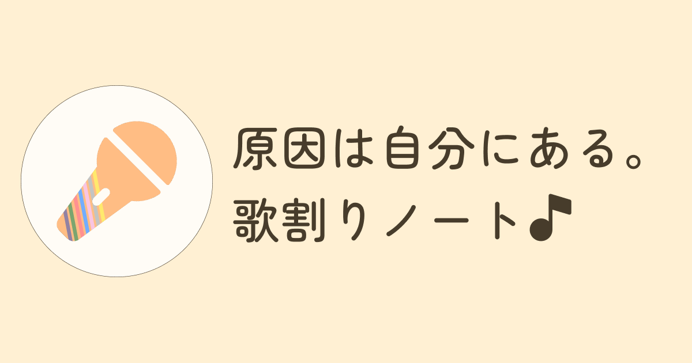

# 原因は自分にある。歌割りノート

7人組ダンスボーカルグループ「原因は自分にある。」の歌割り・パート分けをまとめた非公式ファンサイトです。

🌐 **Webサイト**: [https://observer-ja.github.io/gnjb-utawari-note/](https://observer-ja.github.io/gnjb-utawari-note/)

<!-- サイトのキャプチャ画像があれば配置（任意） -->
<!--  -->

---

## 概要

メンバーごとの詳細な歌割りやパート分けの確認に加え、過去のライブ披露履歴の閲覧や複合条件での楽曲検索ができるWebツールです。  
観測者の皆様の日常的な楽曲鑑賞やライブ前の予習・振り返りツールとしての利便性を追求するとともに、Webフロントエンドの実装・UI/UX設計の学習を兼ねて個人開発・運営しています。

---

## 主な機能

* **歌割り・パート分け表示**
  * メンバーカラーに合わせた直感的なパート色分け表示
  * ライブ時の歌唱実態や演出（ペンライトの動き・コール等）を考慮した独自まとめ
  * 各種公式リンク（YouTube MV / 各サブスクリプション）へのアクセス
* **ライブ披露歴（セットリスト）連携**
  * 各楽曲ページにおける過去のライブ披露実績の開閉式一覧表示
  * 公演名をタップすることで、該当ライブのセットリスト順に並んだ楽曲一覧へ直接アクセス可能
* **複合条件による楽曲検索・絞り込み**
  * リリース時期（期間指定）
  * 収録CD / クリエイター（作詞・作曲・編曲）
  * 過去の出演ライブ
  * 各種フラグ（MV有無 / コール有無 / タイアップ有無）
* **レスポンシブデザイン**
  * スマートフォンでの閲覧に最適化したモバイルファースト設計

---

## 技術構成

### フロントエンド / インフラ
* **Framework**: [Astro](https://astro.build/)
* **Languages**: TypeScript / HTML5 / CSS3
* **Hosting**: GitHub Pages
* **CI/CD**: GitHub Actions
* **Analytics & SEO**: Google Analytics 4 (GA4) / Google Search Console / Schema.org (JSON-LD)

### 開発支援・ツール
* **Design & Prototyping**: [Figma（デザインデータ）](https://www.figma.com/design/k1nFL8lOnF5CJFS4hvGEY1/%E6%AD%8C%E5%89%B2%E3%82%8A%E3%83%9A%E3%83%BC%E3%82%B8?node-id=0-1&t=eJm247KMtXqH1sPZ-1) ※閲覧専用
* **Editor**: Visual Studio Code
* **AI Coding Assistant**: Gemini / Claude

---

## 権利表記・免責事項

* 本サイトは個人が運営する非公式ファンサイトです。
* 株式会社スターダストプロモーション様、所属レコード会社様、および「原因は自分にある。」公式とは一切関係ございません。
* 本サイト内で掲載している歌詞・楽曲情報等は、正規の手続きに基づき利用許諾を得て運営しております。
  * **JASRAC許諾番号**: `第J260843631号`
* 掲載している歌割り・パート分けは、音源およびライブでの歌唱状況を基に管理人が独自に判断・まとめたものです。公式から提供された正確な割り振りを保証するものではございません。また、コールやペンライトの動作等を強要する意図はございません。
* 掲載内容の修正依頼やお問い合わせは、サイト内の[お問い合わせフォーム](https://observer-ja.github.io/gnjb-utawari-note/contact/)よりお願いいたします。

---

## ローカル開発手順

ローカル環境でプロジェクトを起動・検証する手順です。

### 1. リポジトリのクローン
```sh
git clone https://github.com/observer-ja/gnjb-utawari-note.git
cd gnjb-utawari-note
```

### 2. 依存パッケージのインストール
```sh
npm install
```

### 3. 開発サーバの起動
```sh
npm run dev
```
ローカルサーバー（通常は`http://localhost:4321/gnjb-utawari-note/`）が立ち上がります。

### 4. プロダクションビルド
```sh
npm run build
```
ビルド成果物が`./dist`ディレクトリに生成されます。
